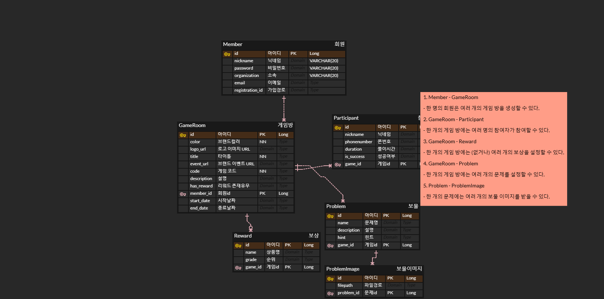
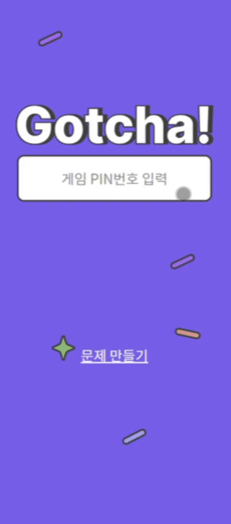
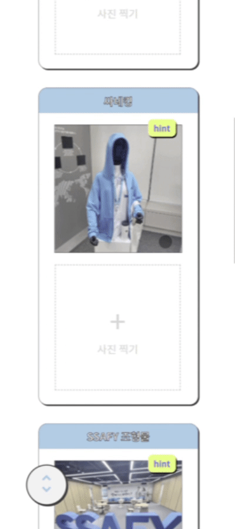
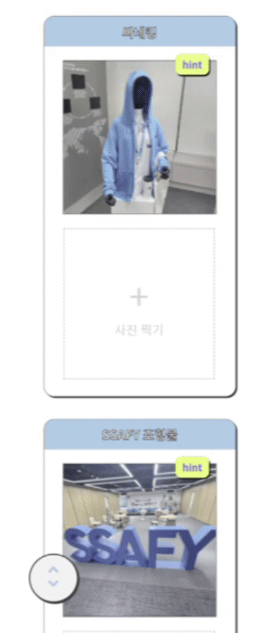
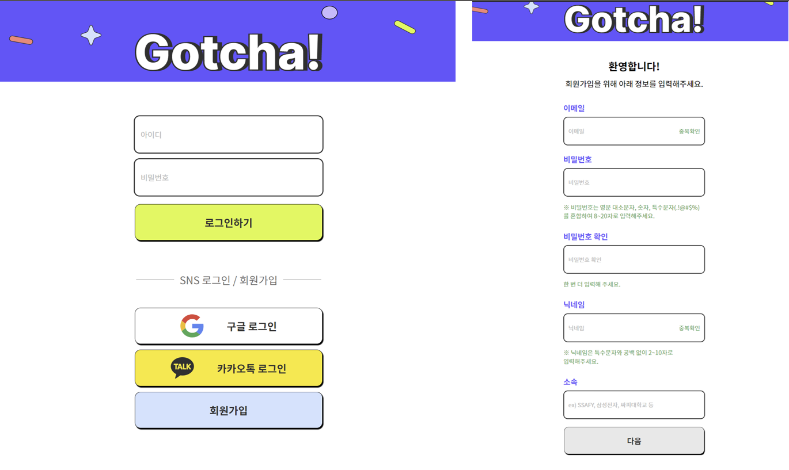
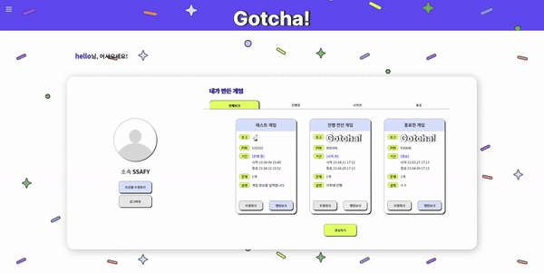
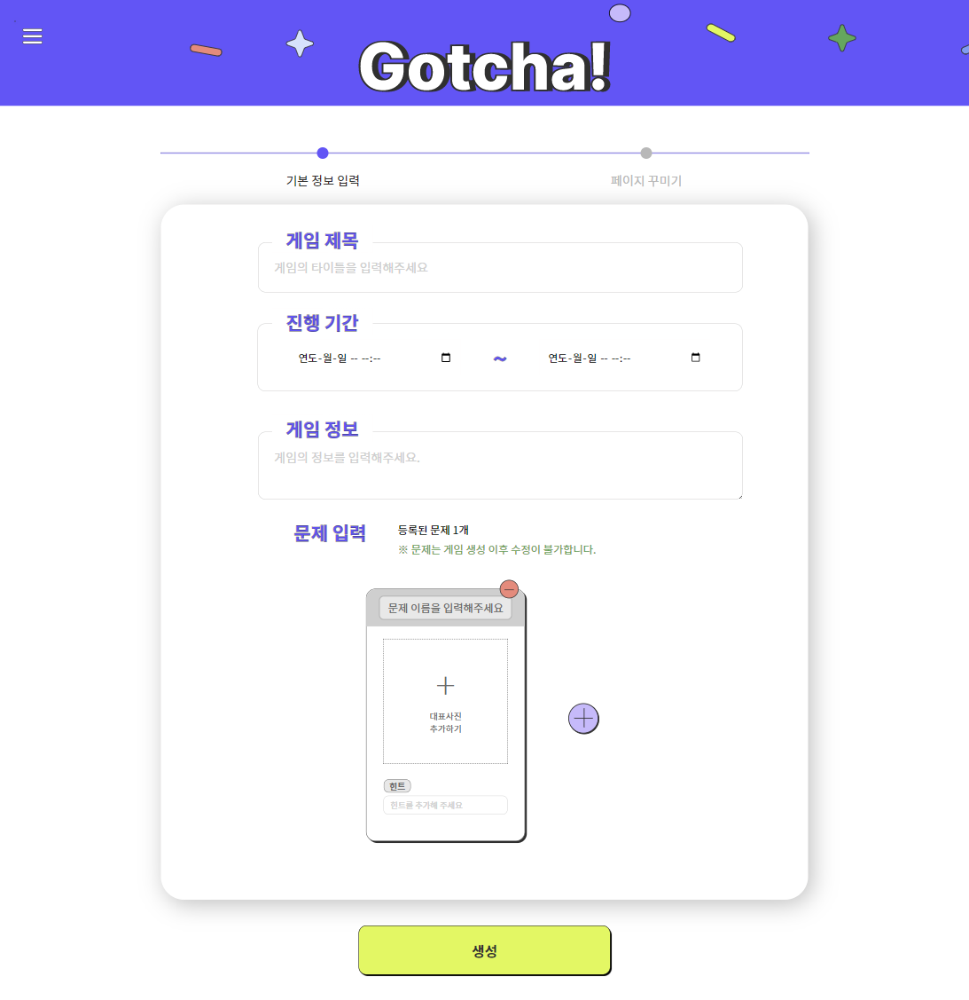
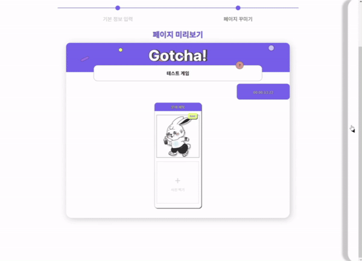
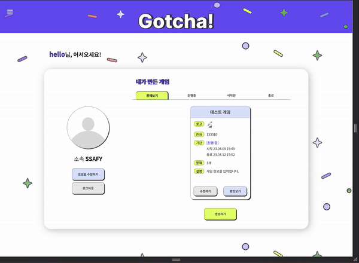
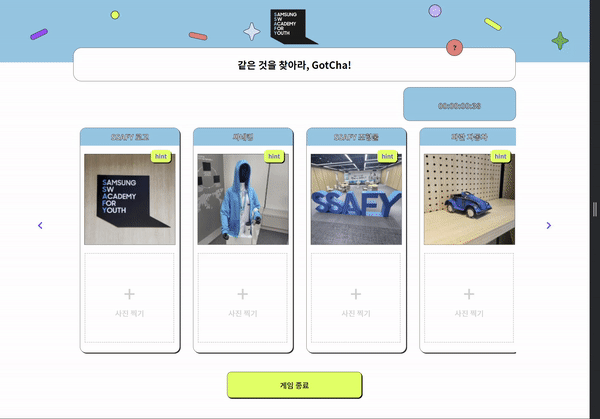

# A602 특화 프로젝트 갓챠

내가 등록한 보물 사진을 토대로 유저가 해당 보물을 찾았는지 AI가 판별해주는 게임 플랫폼

## 📢 이런 기능이 있어요!
① 나만의 AI 보물 찾기 문제 만들기 : 원하는 보물 사진을 등록하면 AI 보물 찾기 게임을 만들 수 있어요
② 나만의 게임 페이지로 커스텀하기 : 자신의 제품을 홍보하고 싶은 기업에서부터 단순 모임에서의 게임까지 원하는 목적에 맞게 게임 페이지를 커스텀 할 수 있어요
③ 찍어서 올리기만하면 AI가 자동 판독 : 참여자가 보물 사진을 찍어 올리면 AI가 자동으로 정답 유무를 판독하고 게임 순위를 알려줘요

## 팀원 : 

 - 최태규 : 팀장 , 백엔드
 - 허예지 : 백엔드
 - 이민수 : 백엔드
 - 김규연 : 프론트엔드
 - 김범찬 : 프론트엔드
 - 박다솜 : 프론트엔드

# ERD

# 기능 명세서

# API 명세서

# 와이어프레임

# 서비스 화면

## 게임 참여자
### 게임 참여
* PIN번호를 통한 간편 참여
* 튜토리얼을 통한 게임방법 안내
* 하단 탭을 통한 문제간 간편 이동
* 닉네임, 비밀번호를 통해 게임 재참여 및 랭킹 확인 가능

### 게임 채점
* SuperPoint, SuperGlue 모델을 활용한 이미지 1:1 대응 비교

## 게임 출제자 
### 회원가입 및 로그인
* 일반 회원 외 구글, 카카오 로그인 지원

### 출제자 마이 페이지
* 게임 진행 시기에 따른 조회
* 게임 생성 및 수정 관리
* 프로필 정보 변경

### 생성 및 커스텀
* 기업 로고, 브랜드 컬러를 활용한 페이지 꾸미기
* 이벤트 url, 상품 등록

## 반응형 디자인
전체 페이지 반응형 적용

