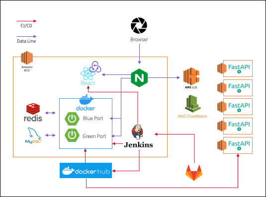

# 사진 1장으로 완성하는 AI 게임 서비스, Gotcha!

> **Gotcha는 브랜드 팝업스토어에서 사용할 수 있는 AI 보물 찾기 게임 서비스입니다.** 

참여자가 팝업스토어를 돌아다니며 브랜드에서 출제한 다양한 제품, 물건들을 찾아 사진을 찍어 인증하는 게임을 제공합니다.  
참여자가 자발적으로 브랜드 제품과 물건을 찾아냄으로써, 더 재밌고 더 쉽게 브랜드에 대해 알아갈 수 있습니다.

## 주요 기능
**① 나만의 AI 게임 만들기 :** 사진을 단 1장만 등록하면 AI 보물 찾기 게임을 만들 수 있어요  
**② 게임 페이지 커스텀하기 :** 브랜드 로고, 컬러 등 이벤트에 필요한 내용만 입력하면 브랜드만의 게임 페이지를 커스텀 할 수 있어요  
**③ 찍어서 올리기만하면 AI가 자동 판독 :** 참여자가 사진을 찍어 올리면 AI가 자동으로 정답 유무를 판독하고 게임 순위를 알려줘요  

## 세부 기능
|구분|기능|설명|
|:--:|--|--|
|1|게임관리|게임을 생성하고, 원하는 로고, 색상 등을 입력해 게임 페이지를 꾸밀 수 있다|
|2|문제관리|각 게임에 대한 문제를 입력하고 수정 및 삭제를 할 수 있다|
|3|게임참여|핀코드를 통해 게임에 접속하여 사진을 찍어 문제를 풀 수 있다|
|4|랭킹관리|각 방별 랭킹 정보 제공하며 랭킹에 따른 경품 정보 제공한다|
|5|회원관리|각종 회원 정보 수정 기능을 제공한다|

## 아키텍쳐
> **서버를 일반적인 요청을 받는 Spring 서버와 AI가 정답을 체크해주는 Python 서버로 분리**
1) Spring 서버는 Blue/Green 무중단 배포 전략 사용
2) Python 서버는 트래픽의 증감에 따라 유연적인 대응을 할 수 있도록 ALB, CloudWatch를 사용해 Auto-scaling 구현

## 사용 예시

1. 소개 영상 : [유튜브 링크](https://youtu.be/RhVHskESv_M)

2. 상세 설명 : [Wiki](https://github.com/GotchaAIGame/Gotcha/wiki)
